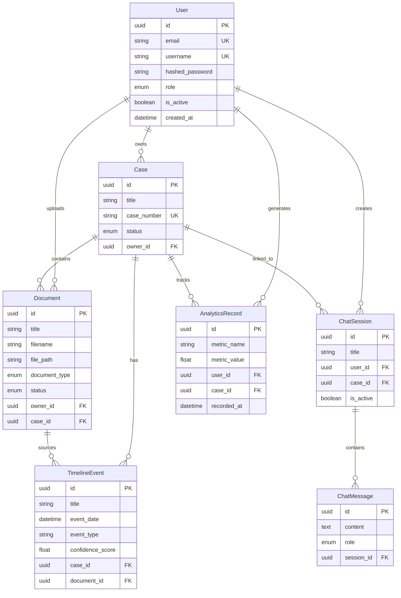

# ChronoLegal Architecture

## System Overview

ChronoLegal is a legal-tech platform for question answering and case analytics. Phase 1 establishes a clean monorepo foundation with a decoupled frontend/backend architecture.

```
┌─────────────────────────────────────────────────────────────┐
│                     Frontend (Next.js)                       │
│  Pages → Services (Axios) → React Query → Zustand Store     │
└──────────────────────────┬──────────────────────────────────┘
                           │ HTTP/REST
┌──────────────────────────▼──────────────────────────────────┐
│                     Backend (FastAPI)                        │
│  Routes → Schemas (Pydantic) → Services → Models (SQLAlchemy)│
└──────────────────────────┬──────────────────────────────────┘
                           │ (Phase 2)
┌──────────────────────────▼──────────────────────────────────┐
│                     PostgreSQL Database                      │
└─────────────────────────────────────────────────────────────┘
```

## Backend Structure

```
backend/
├── app/
│   ├── api/
│   │   ├── deps.py              # JWT-ready dependencies
│   │   ├── router.py            # API router aggregation
│   │   └── routes/              # Route modules per domain
│   ├── core/
│   │   ├── config.py            # Pydantic settings
│   │   └── security.py          # JWT + password hashing
│   ├── db/
│   │   ├── base.py              # SQLAlchemy declarative base
│   │   └── session.py           # Engine + session factory
│   ├── models/                  # SQLAlchemy ORM models
│   ├── schemas/                 # Pydantic request/response schemas
│   ├── services/                # Business logic (mock in Phase 1)
│   ├── utils/                   # Helper utilities
│   └── middleware/              # Request logging middleware
├── alembic/                     # Database migrations
├── tests/                       # API tests
└── main.py                      # Application entry point
```

## Frontend Structure

```
frontend/src/
├── app/
│   ├── (auth)/                  # Login, Register (no sidebar)
│   ├── (dashboard)/             # Main app pages with sidebar
│   └── not-found.tsx
├── components/
│   ├── layout/                  # Sidebar, TopNav, DashboardLayout
│   ├── ui/                      # Shadcn UI components
│   └── providers.tsx            # React Query + Theme providers
├── services/                    # API service layer (Axios)
├── stores/                      # Zustand state (auth, UI, chat)
├── types/                       # TypeScript interfaces
└── lib/                         # Utils + API client
```

## Entity-Relationship Diagram



## Table Descriptions

### users
Stores authenticated platform users. Supports roles (`user`, `admin`, `lawyer`) for future RBAC.

### cases
Legal cases owned by users. Central entity linking documents, timeline events, chat sessions, and analytics.

### documents
Uploaded legal files (PDF, DOCX, TXT). Tracks processing status for future OCR/extraction pipeline.

### timeline_events
Temporal legal events extracted from documents. Includes confidence scores for ChronoLegal integration.

### chat_sessions
Conversation containers for legal Q&A. Optionally linked to a specific case for context-aware RAG.

### chat_messages
Individual messages within a chat session. Supports `user`, `assistant`, and `system` roles.

### analytics_records
Time-series metric storage for dashboard analytics and case performance tracking.

## Relationships Summary

| Parent | Child | Relationship | On Delete |
|--------|-------|--------------|-----------|
| User | Case | One-to-Many | CASCADE |
| User | Document | One-to-Many | CASCADE |
| User | ChatSession | One-to-Many | CASCADE |
| User | AnalyticsRecord | One-to-Many | CASCADE |
| Case | Document | One-to-Many | SET NULL |
| Case | TimelineEvent | One-to-Many | CASCADE |
| Case | ChatSession | One-to-Many | SET NULL |
| Document | TimelineEvent | One-to-Many | SET NULL |
| ChatSession | ChatMessage | One-to-Many | CASCADE |

## Authentication Architecture (JWT-Ready)

Phase 1 returns mock tokens. Phase 2 will enforce:

1. `POST /api/auth/login` → access + refresh tokens
2. Access token in `Authorization: Bearer` header
3. `app/api/deps.py` validates JWT via `python-jose`
4. Password hashing via `passlib[bcrypt]`

## Future Expansion Points

### Phase 2 — Persistence
- Connect PostgreSQL via `DATABASE_URL`
- Run Alembic migrations
- Replace `MockDataService` with repository pattern

### Phase 3 — Document Processing
- File storage (local/S3)
- OCR pipeline (Tesseract/Azure)
- Text chunking and metadata extraction

### Phase 4 — ChronoLegal Integration
- Event extraction from legal text
- Temporal graph construction
- Timeline visualization (D3.js/Cytoscape)

### Phase 5 — AI/RAG
- Embedding generation
- Vector database (Pinecone/Weaviate/pgvector)
- RAG retrieval pipeline
- LLM integration (OpenAI/Ollama) for legal reasoning

### Phase 6 — Analytics
- Real-time metrics aggregation
- Chart libraries (Recharts/Chart.js)
- Case outcome prediction models
